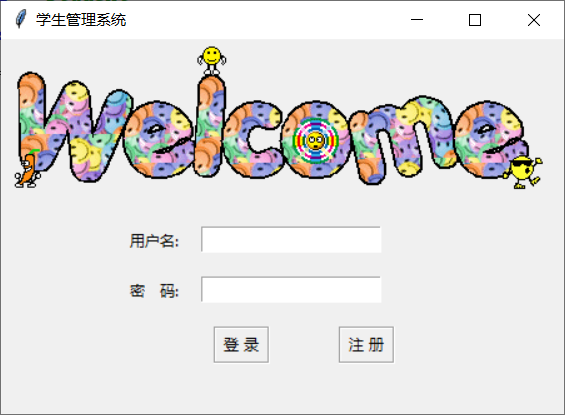
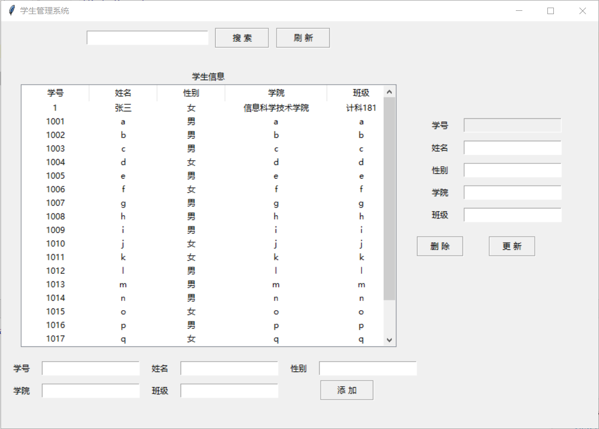
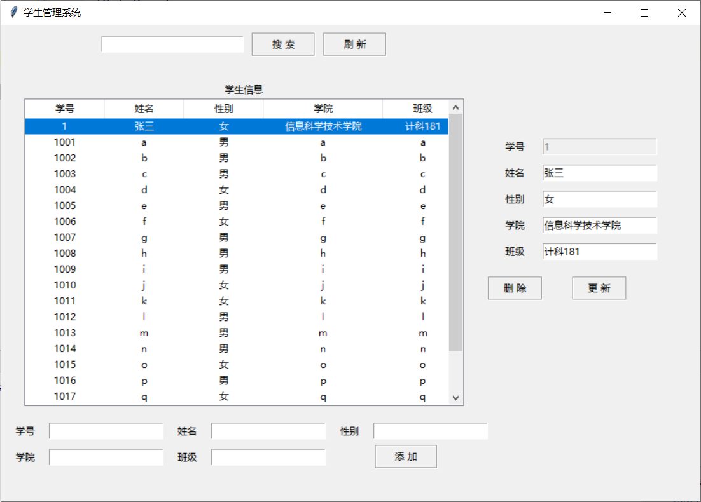
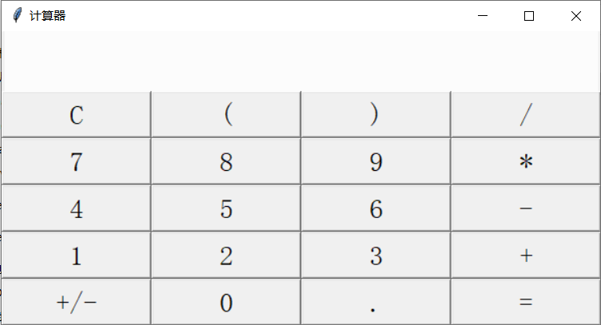
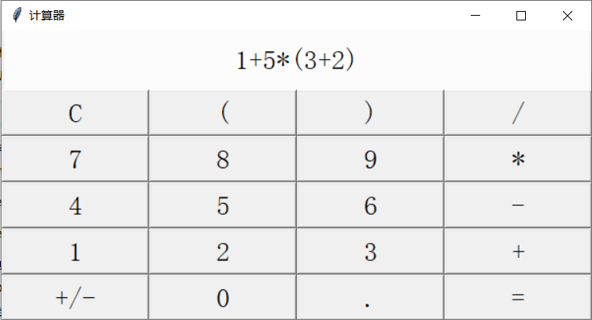
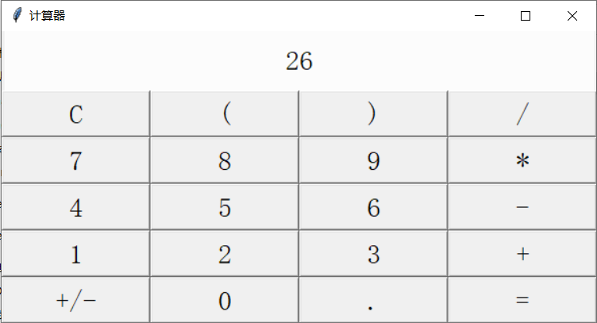
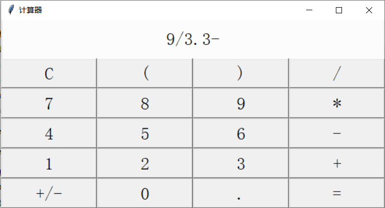
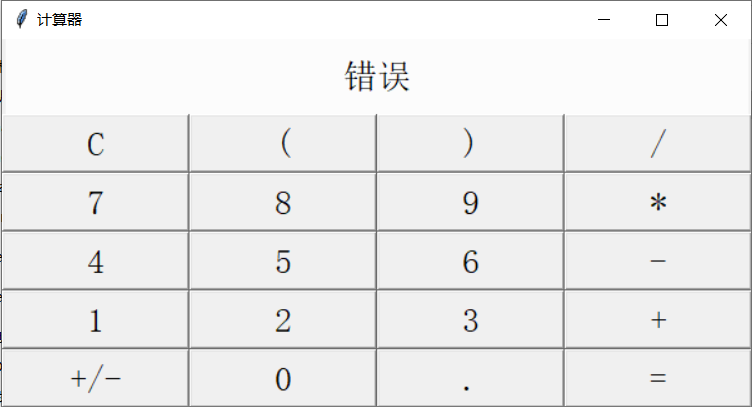

# student-assigment
Python课程作业，win32软件

其中一个是基于tkinter和MySQL实现的学生管理系统，因为只是一个日常作业，所以没有花费太多时间仅实现了基本的增删改查功能。

另一个是使用Tkinter实现的简单计算器，可以处理带括号的长算式。

还有一个是使用PyQT5开发的文件加密软件。

[学神信息管理](./student)

[计算器](./calculator)

[文件加密](./file_encryption)

## 开发环境

PyCharm

python == 3.7

打包工具： PyInstaller == 3.6

## 部署说明

### 学生管理系统

数据使用MySQL存储，请先使用**student.sql**建立数据库，然后修改**config.ini**中的数据库连接信息，之后再将项目导入PyCharm或者其他IDE，程序入口文件为**login.py**。

dist目录中有已经打包好的exe文件，修改**config.ini**中的数据库配置后理论上可以运行。

如果需要修改程序后重新打包成exe文件，可使用PyInstaller或者其他打包工具，打包后记得**将config.ini和welcome.gif复制到exe文件所在目录，否则无法运行**（具体视修改情况）。

学生管理打包命令：

```cmd
pyinstaller -F -w login.py -p database.py -p gui.py -p view.py
```

---------

### 计算器

计算器入口文件为**main.py**，view.py只是一个界面，无功能

计算器打包命令：

```cmd
pyinstaller -F -w main.py -p view.py
```

---

### 文件加密

见[文件加密](./file_encryption)的word文件

## 运行截图

### 学生管理系统








### 计算器











### 文件加密

见[文件加密](./file_encryption)中的word文件