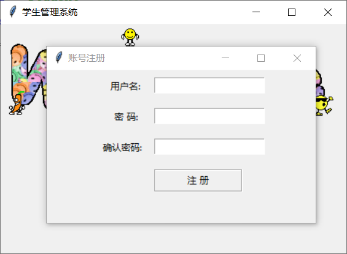

# student-assigment
Python课程作业，基于tkinter和MySQL实现的学生管理系统，因为只是一个日常作业，所以没有花费太多时间，仅实现了基本的增删改查功能。

## 开发环境

PyCharm

python == 3.7

PyMySQL  ==  0.9.3

打包工具： PyInstaller == 3.6

## 使用说明

数据使用MySQL存储，请先使用**student.sql**建立数据库，然后修改**config.ini**中的数据库连接信息，之后再将项目导入PyCharm或者其他IDE，程序入口文件为**login.py**。

dist目录中有已经打包好的exe文件，修改**config.ini**中的数据库配置后理论上可以运行。

如果需要修改程序后重新打包成exe文件，可使用PyInstaller或者其他打包工具，打包后记得**将config.ini和welcome.gif复制到exe文件所在目录，否则无法运行**（具体视修改情况）。

打包命令：

```cmd
pyinstaller -F -w login.py -p database.py -p gui.py -p view.py
```

## 运行截图





